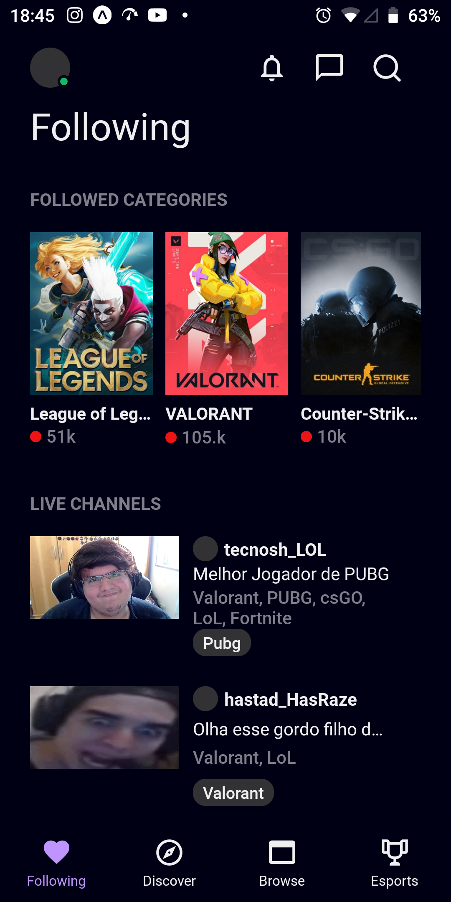
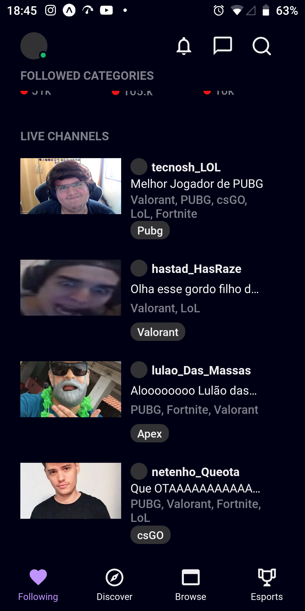
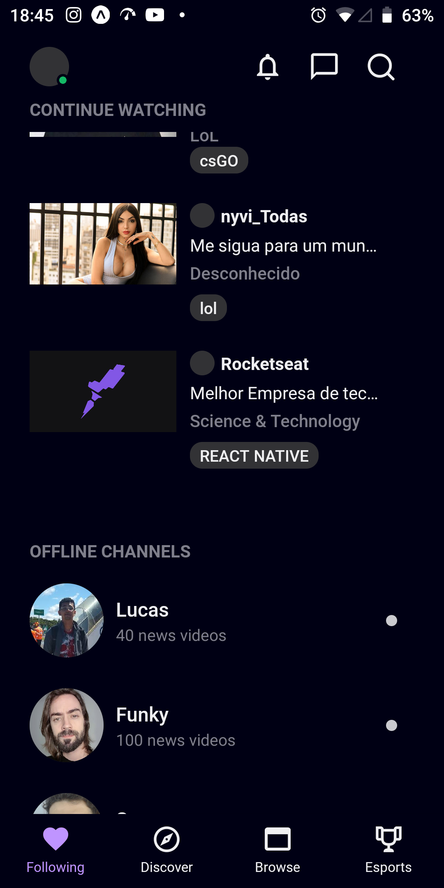

# Clone da interface da Twitch :calling:

## Esse projeto reproduz a interface da Twitch Tv Mobile utilizando Expo + Typescript + React Native.
## O projeto foi realizado graças as "Aulas" da Rocketseat.

## A clonagem da interface possuí duas páginas, ComingSoon e Following. A página ComingSoon é utilizada nas outras funcionalidades do projeto, por exemplo o Discover, e a Following representa a página inicial.

## A pasta styles contém as informações globais de estilização do projeto, por exemplo, cores do projeto.

## Foi utilizado a arquitetura de componintização no projeto. Grande maioria dos componentes são utilizados na página Following.

## Imagem da Following page:

## O componente Título é usado para atribuir títulos às divisões do projeto, por exemplo, na imgem acima a frase "Followed Categories" é enviada e estilizada pelo componente em questão.

## O Header é o cabeçalho do projeto que contém a imagem do usuário, três botões e o ícone ok On. Por outro lado, o componente Heading é usado para o nome da página que o usuário está usando, como o nome sugere, o título.

## StreamList organiza os usuários que estão em Lives. As imagens são meramente ilustrativas.

## Os componentes CategoryList e ChannelList têm as mesmas características do StreamList, mas são usados para outras ações.

